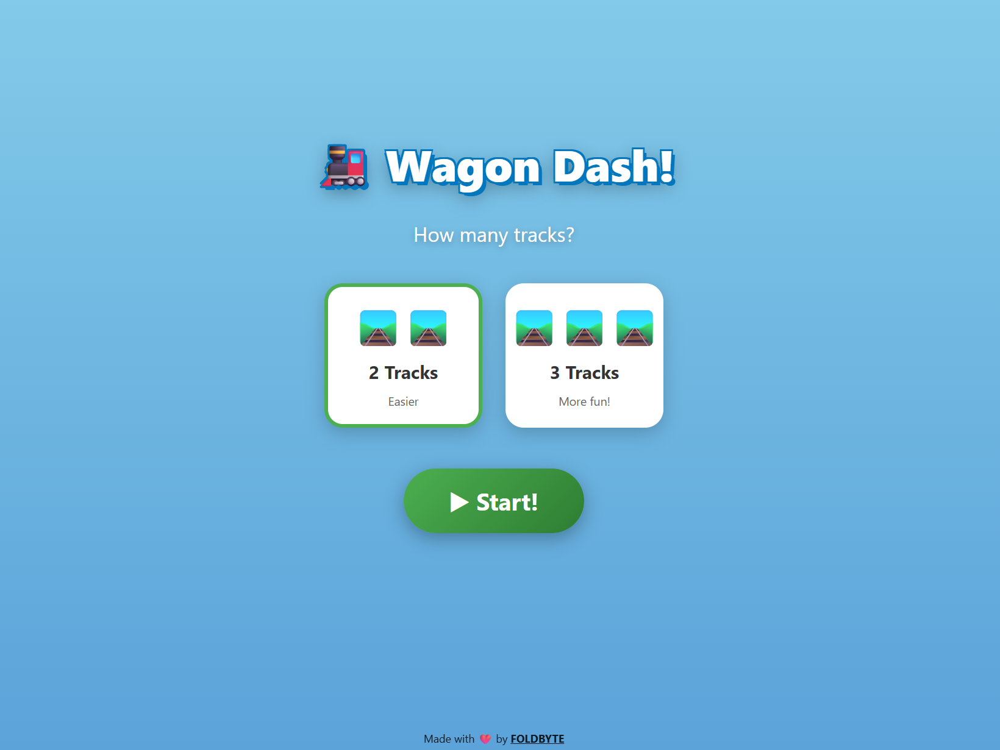
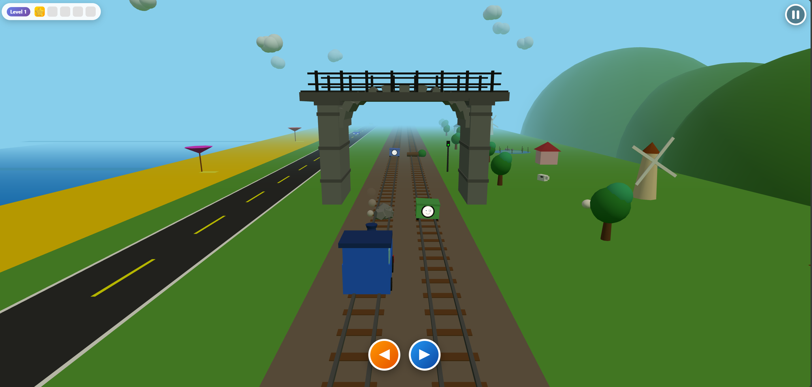
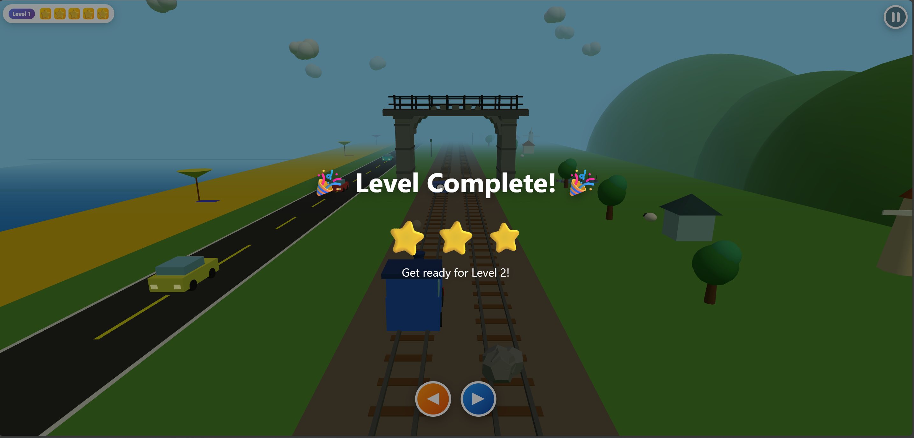

# Wagon Dash

Low-poly railway mini game built with Three.js. Ride the track through a stylized 3D landscape with smooth, mobile-friendly controls.

**Target audience:** children aged **3–5 years**.

## Demo

Play the live demo here: https://wagondash.foldbyte.cz/

## Screenshots

## Features

- 3D scene rendered in Three.js (rails + terrain)
- Simple on-screen controls (mobile friendly)
- Responsive canvas sizing (stable viewport on mobile)
- Lightweight, static project (no backend)

## How to run

You can open `index.html` directly in a browser, but some browsers may restrict loading assets due to CORS.

## Controls

- Use the on-screen buttons (⬅️ / ➡️) to control the wagon.
- Desktop users can also use keyboard arrows if enabled in the build.

## Tech

- Three.js
- Vanilla HTML / CSS / JavaScript
